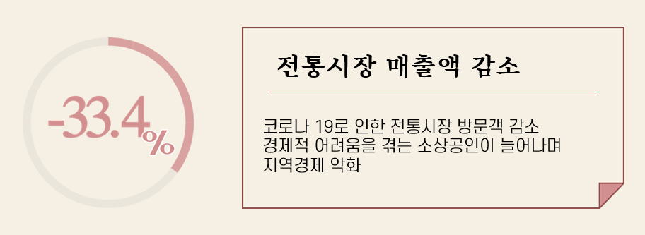
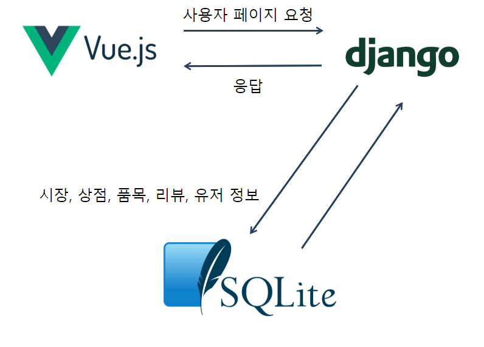
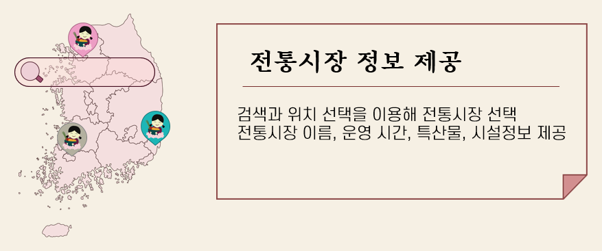
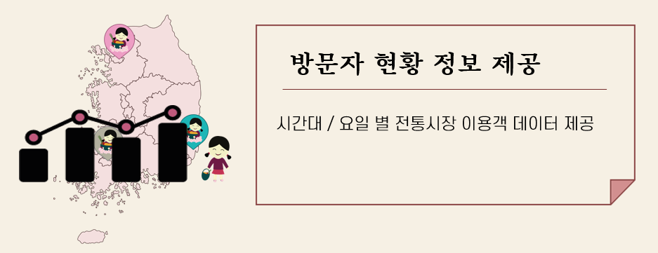

## 전통시장 정보 제공 사이트 for Angelhack Seoul Hackathon 2020

---

# 가제: 전통시장 가즈아

## 기획의도 :money_with_wings:

[코로나 19로 전통시장 방문객 급격히 감소]

코로나 19 지역 확진자의 지속 발생으로 지역사회의 경영상 어려움이 이어지고 있습니다. 특히 전통시장 주변에서의 코로나 19 확진자 발생은 전통시장에게 큰 악영향을 주고 있습니다. 소상공인 매출액은 코로나 19 발생 이전보다 33.4% 줄었으며 기업대출도 76조 증가했습니다.

[전통시장 소상공인의 경제적 안정을 바라며]

전통시장 소상공인과 전통시장 이용객을 위한 웹 서비스로 전통시장을 찾는 사람들이 더욱 많아지길 바랍니다. 서비스를 이용하는 고객들이 전통시장과 관련된 정보를 손쉽게 접하고 시간대별 이용객을 확인하여 코로나 19 상황에서도 안심하고 전통시장을 이용할 수 있길 바랍니다. 전통시장 고객이 늘고 매출이 증가하기를 기대합니다.

## 서비스 구조 :computer:

흐름도 및 기술스택

## 기능

* 전통시장 정보 제공

  

  네이버 / 카카오 맵 API를 이용해 (서울 내) 전통시장에 대한 정보를 제공합니다. 전통시장의 위치를 기반으로 전통시장 이름, 운영 시간, 특산물, 화장실 및 주차장 정보를 제공합니다.

* 방문자 현황 정보 제공

  

  서울 열린 데이터 광장 API를 통해 전통시장 이용객 정보를 받아옵니다. 시간/요일 별 이용객 테이터를 가공해 제공합니다. 고객은 이용자가 적은 시간대를 선택해 전통시장을 방문할 수 있습니다.

* 전통시장 커뮤니티

  

  커뮤니티 공간을 제공하여 이용자들은 전통시장에 관한 생생한 리뷰를 쓰고  소통할 수 있습니다. 

## 비즈니스 모델

* 수수료

  전통시장 정보와 시장 내의 상점 정보를 제공에 따른 수수료

* 정부 / 공공기관과 협업

* 광고 수익

  서비스 내에 광고를 게재하여 수익 창출

## 역할

- 김윤재 : 팀장, 백엔드 데이터 crawling, 배포
- 박권응 : 프론트엔드 카카오맵 API
- 백민주 : 백엔드 modeling, 데이터 input, API
- 윤가영: 백엔드 QR code 관련 modeling, API
- 이설유 : 프론트엔드 UX, UI 디자인
